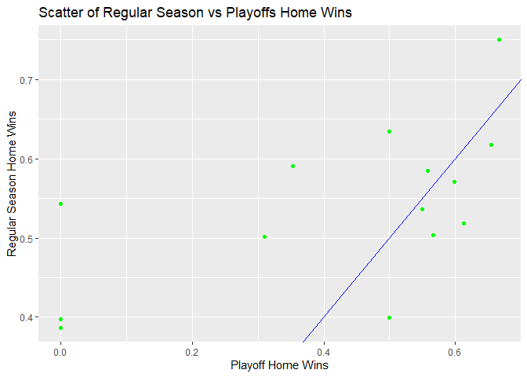

-   [Packages required to load and analyse the
    data](#packages-required-to-load-and-analyse-the-data)
-   [Introduction](#introduction)
-   [Reading data from the National Hockey League’s (NHL) records
    API](#reading-data-from-the-national-hockey-leagues-nhl-records-api)
    -   [Franchise data](#franchise-data)
    -   [Franchise team totals](#franchise-team-totals)
    -   [Franchise season records](#franchise-season-records)
    -   [Franchise goalie records](#franchise-goalie-records)
    -   [Franchise skater records](#franchise-skater-records)
    -   [Franchise detail](#franchise-detail)
-   [Reading data from the National Hockey League’s (NHL) stat
    API](#reading-data-from-the-national-hockey-leagues-nhl-stat-api)
-   [Wrapper function to access API
    endpoints](#wrapper-function-to-access-api-endpoints)
-   [Exploratory Data Analysis](#exploratory-data-analysis)
    -   [Data from 2 endpoints](#data-from-2-endpoints)
        -   [Some data for active and inactive players of the Dallas
            Stars](#some-data-for-active-and-inactive-players-of-the-dallas-stars)
        -   [Home and away records for all teams during regular
            season](#home-and-away-records-for-all-teams-during-regular-season)
    -   [Creation of new variables](#creation-of-new-variables)
    -   [Contingency table](#contingency-table)
        -   [Summary of active and inactive players for the Dallas
            Stars](#summary-of-active-and-inactive-players-for-the-dallas-stars)
    -   [Numerical Summaries](#numerical-summaries)
        -   [Summary of assists by position for the Dallas
            Stars](#summary-of-assists-by-position-for-the-dallas-stars)
        -   [Summary of penalty minutes by position for the Dallas
            Stars](#summary-of-penalty-minutes-by-position-for-the-dallas-stars)
    -   [Graphics](#graphics)
        -   [Graph of regular season home win percent vs playoff home
            win
            percent](#graph-of-regular-season-home-win-percent-vs-playoff-home-win-percent)

    knitr::opts_chunk$set(fig.path='Figs/')

# Packages required to load and analyse the data

The following packages are needed for reading and analyzing the data:

    packages <- c("tidyverse","httr","jsonlite","rmarkdown", "knitr","DT","summarytools")
    lapply(packages, library, character.only = TRUE)

# Introduction

This vignette reads data from the [NHL records
API](https://gitlab.com/dword4/nhlapi/-/blob/master/records-api.md)
(using functions from the `httr` and `jsonlite` packages) and shows some
basic exploratory data analysis using tools available in the `tidyverse`
package.

# Reading data from the National Hockey League’s (NHL) records API

## Franchise data

The franchise data returns id, firstSeasonId and last SeasonId and name
of every team in the history of the NHL.

    get_franchise_data <- function()  {
      prefix_url <- "https://records.nhl.com/site/api"
      franchise_url <- paste0(prefix_url,"/","franchise")
      franchise_list <- franchise_url %>% GET() %>% content(.,"text") %>% fromJSON(.,flatten = TRUE)
      
      return(franchise_list$data)
    }

## Franchise team totals

The franchise team totals returns the total stats for every franchise:

    get_franchise_team_totals <- function()  {
      prefix_url <- "https://records.nhl.com/site/api"
      franchise_totals_url <- paste0(prefix_url,"/","franchise-team-totals")
      franchise_totals_list <- franchise_totals_url %>% GET() %>% content(.,"text") %>% fromJSON(.,flatten = TRUE)
      
      return(franchise_totals_list$data)
    }

## Franchise season records

The franchise season records drills down into season records for a
specified franchise when the **franchiseId**, represented as **ID**
below, is provided.As an option, both the *ID* and full team name can be
supplied, as long as they are matched in the database

    get_franchise_season_records <- function(ID, name){
      if  (ID %in% c(1:nrow(get_franchise_data())))  {
        if  (missing(name))  {
          prefix_url <- "https://records.nhl.com/site/api"
          franchise_season_records_url <- paste0(prefix_url,"/","franchise-season-records?cayenneExp=franchiseId=",ID)
          franchise_season_records_list <- franchise_season_records_url %>% GET() %>% content(.,"text") %>% fromJSON(.,flatten = TRUE)
      
          return(franchise_season_records_list$data)
      
        } else if  (name %in% get_franchise_data()$fullName)  {
            if  (ID != which(get_franchise_data()$fullName == name))  {
              stop ("The franchise id entered is not for the team selected")
            }
            ID <- which(get_franchise_data()$fullName == name)
            prefix_url <- "https://records.nhl.com/site/api"
            franchise_season_records_url <- paste0(prefix_url,"/","franchise-season-records?cayenneExp=franchiseId=",ID)
            franchise_season_records_list <- franchise_season_records_url %>% GET() %>% content(.,"text") %>% fromJSON(.,flatten = TRUE) 
        
            return(franchise_season_records_list$data)
          }
      }   
    }

For example, the team with **franchiseID** = 6 (Boston Bruins) has the
following season record:

    kable(head(get_franchise_season_records(6,"Boston Bruins")))

<table>
<colgroup>
<col style="width: 0%" />
<col style="width: 1%" />
<col style="width: 1%" />
<col style="width: 2%" />
<col style="width: 1%" />
<col style="width: 1%" />
<col style="width: 1%" />
<col style="width: 1%" />
<col style="width: 1%" />
<col style="width: 1%" />
<col style="width: 1%" />
<col style="width: 1%" />
<col style="width: 1%" />
<col style="width: 1%" />
<col style="width: 1%" />
<col style="width: 1%" />
<col style="width: 2%" />
<col style="width: 1%" />
<col style="width: 2%" />
<col style="width: 1%" />
<col style="width: 2%" />
<col style="width: 1%" />
<col style="width: 2%" />
<col style="width: 1%" />
<col style="width: 2%" />
<col style="width: 1%" />
<col style="width: 2%" />
<col style="width: 0%" />
<col style="width: 1%" />
<col style="width: 2%" />
<col style="width: 1%" />
<col style="width: 1%" />
<col style="width: 2%" />
<col style="width: 1%" />
<col style="width: 2%" />
<col style="width: 1%" />
<col style="width: 1%" />
<col style="width: 1%" />
<col style="width: 1%" />
<col style="width: 0%" />
<col style="width: 1%" />
<col style="width: 0%" />
<col style="width: 1%" />
<col style="width: 1%" />
<col style="width: 2%" />
<col style="width: 1%" />
<col style="width: 2%" />
<col style="width: 1%" />
<col style="width: 2%" />
<col style="width: 1%" />
<col style="width: 2%" />
<col style="width: 1%" />
<col style="width: 7%" />
<col style="width: 0%" />
<col style="width: 2%" />
<col style="width: 1%" />
<col style="width: 2%" />
</colgroup>
<thead>
<tr class="header">
<th style="text-align: right;">id</th>
<th style="text-align: right;">fewestGoals</th>
<th style="text-align: right;">fewestGoalsAgainst</th>
<th style="text-align: left;">fewestGoalsAgainstSeasons</th>
<th style="text-align: left;">fewestGoalsSeasons</th>
<th style="text-align: right;">fewestLosses</th>
<th style="text-align: left;">fewestLossesSeasons</th>
<th style="text-align: right;">fewestPoints</th>
<th style="text-align: left;">fewestPointsSeasons</th>
<th style="text-align: right;">fewestTies</th>
<th style="text-align: left;">fewestTiesSeasons</th>
<th style="text-align: right;">fewestWins</th>
<th style="text-align: left;">fewestWinsSeasons</th>
<th style="text-align: right;">franchiseId</th>
<th style="text-align: left;">franchiseName</th>
<th style="text-align: right;">homeLossStreak</th>
<th style="text-align: left;">homeLossStreakDates</th>
<th style="text-align: right;">homePointStreak</th>
<th style="text-align: left;">homePointStreakDates</th>
<th style="text-align: right;">homeWinStreak</th>
<th style="text-align: left;">homeWinStreakDates</th>
<th style="text-align: right;">homeWinlessStreak</th>
<th style="text-align: left;">homeWinlessStreakDates</th>
<th style="text-align: right;">lossStreak</th>
<th style="text-align: left;">lossStreakDates</th>
<th style="text-align: right;">mostGameGoals</th>
<th style="text-align: left;">mostGameGoalsDates</th>
<th style="text-align: right;">mostGoals</th>
<th style="text-align: right;">mostGoalsAgainst</th>
<th style="text-align: left;">mostGoalsAgainstSeasons</th>
<th style="text-align: left;">mostGoalsSeasons</th>
<th style="text-align: right;">mostLosses</th>
<th style="text-align: left;">mostLossesSeasons</th>
<th style="text-align: right;">mostPenaltyMinutes</th>
<th style="text-align: left;">mostPenaltyMinutesSeasons</th>
<th style="text-align: right;">mostPoints</th>
<th style="text-align: left;">mostPointsSeasons</th>
<th style="text-align: right;">mostShutouts</th>
<th style="text-align: left;">mostShutoutsSeasons</th>
<th style="text-align: right;">mostTies</th>
<th style="text-align: left;">mostTiesSeasons</th>
<th style="text-align: right;">mostWins</th>
<th style="text-align: left;">mostWinsSeasons</th>
<th style="text-align: right;">pointStreak</th>
<th style="text-align: left;">pointStreakDates</th>
<th style="text-align: right;">roadLossStreak</th>
<th style="text-align: left;">roadLossStreakDates</th>
<th style="text-align: right;">roadPointStreak</th>
<th style="text-align: left;">roadPointStreakDates</th>
<th style="text-align: right;">roadWinStreak</th>
<th style="text-align: left;">roadWinStreakDates</th>
<th style="text-align: right;">roadWinlessStreak</th>
<th style="text-align: left;">roadWinlessStreakDates</th>
<th style="text-align: right;">winStreak</th>
<th style="text-align: left;">winStreakDates</th>
<th style="text-align: right;">winlessStreak</th>
<th style="text-align: left;">winlessStreakDates</th>
</tr>
</thead>
<tbody>
<tr class="odd">
<td style="text-align: right;">6</td>
<td style="text-align: right;">147</td>
<td style="text-align: right;">172</td>
<td style="text-align: left;">1952-53 (70)</td>
<td style="text-align: left;">1955-56 (70)</td>
<td style="text-align: right;">13</td>
<td style="text-align: left;">1971-72 (78)</td>
<td style="text-align: right;">38</td>
<td style="text-align: left;">1961-62 (70)</td>
<td style="text-align: right;">5</td>
<td style="text-align: left;">1972-73 (78)</td>
<td style="text-align: right;">14</td>
<td style="text-align: left;">1962-63 (70)</td>
<td style="text-align: right;">6</td>
<td style="text-align: left;">Boston Bruins</td>
<td style="text-align: right;">11</td>
<td style="text-align: left;">Dec 08 1924 - Feb 17 1925</td>
<td style="text-align: right;">27</td>
<td style="text-align: left;">Nov 22 1970 - Mar 20 1971</td>
<td style="text-align: right;">20</td>
<td style="text-align: left;">Dec 03 1929 - Mar 18 1930</td>
<td style="text-align: right;">11</td>
<td style="text-align: left;">Dec 08 1924 - Feb 17 1925</td>
<td style="text-align: right;">11</td>
<td style="text-align: left;">Dec 03 1924 - Jan 05 1925</td>
<td style="text-align: right;">14</td>
<td style="text-align: left;">Jan 21 1945 - NYR 3 @ BOS 14</td>
<td style="text-align: right;">399</td>
<td style="text-align: right;">306</td>
<td style="text-align: left;">1961-62 (70)</td>
<td style="text-align: left;">1970-71 (78)</td>
<td style="text-align: right;">47</td>
<td style="text-align: left;">1961-62 (70), 1996-97 (82)</td>
<td style="text-align: right;">2443</td>
<td style="text-align: left;">1987-88 (80)</td>
<td style="text-align: right;">121</td>
<td style="text-align: left;">1970-71 (78)</td>
<td style="text-align: right;">15</td>
<td style="text-align: left;">1927-28 (44)</td>
<td style="text-align: right;">21</td>
<td style="text-align: left;">1954-55 (70)</td>
<td style="text-align: right;">57</td>
<td style="text-align: left;">1970-71 (78)</td>
<td style="text-align: right;">23</td>
<td style="text-align: left;">Dec 22 1940 - Feb 23 1941</td>
<td style="text-align: right;">14</td>
<td style="text-align: left;">Dec 27 1964 - Feb 21 1965</td>
<td style="text-align: right;">16</td>
<td style="text-align: left;">Jan 11 2014 - Mar 30 2014</td>
<td style="text-align: right;">9</td>
<td style="text-align: left;">Mar 02 2014 - Mar 30 2014</td>
<td style="text-align: right;">14</td>
<td style="text-align: left;">Oct 12 1963 - Dec 14 1963, Dec 27 1964 - Feb 21 1965, Nov 09 1966 - Jan 07 1967</td>
<td style="text-align: right;">14</td>
<td style="text-align: left;">Dec 03 1929 - Jan 09 1930</td>
<td style="text-align: right;">20</td>
<td style="text-align: left;">Jan 28 1962 - Mar 11 1962</td>
</tr>
</tbody>
</table>

## Franchise goalie records

The franchise season records returns goalie records for a specified
franchise when the **franchiseId** with or without the team name is
provided:

    get_franchise_goalie_records <- function(ID, name){
      if  (ID %in% c(1:nrow(get_franchise_data())))  {
        if  (missing(name))  {
          prefix_url <- "https://records.nhl.com/site/api"
          franchise_goalie_records_url <- paste0(prefix_url,"/","franchise-goalie-records?cayenneExp=franchiseId=",ID)
          franchise_goalie_records_list <- franchise_goalie_records_url %>% GET() %>% content(.,"text") %>% fromJSON(.,flatten = TRUE)
      
          return(franchise_goalie_records_list$data)
      
        } else if  (name %in% get_franchise_data()$fullName)  {
            if  (ID != which(get_franchise_data()$fullName == name))  {
              stop ("The franchise id entered is not for the team selected")
            }
            ID <- which(get_franchise_data()$fullName == name)
            prefix_url <- "https://records.nhl.com/site/api"
            franchise_goalie_records_url <- paste0(prefix_url,"/","franchise-goalie-records?cayenneExp=franchiseId=",ID)
            franchise_goalie_records_list <- franchise_goalie_records_url %>% GET() %>% content(.,"text") %>% fromJSON(.,flatten = TRUE)
      
            return(franchise_goalie_records_list$data)
          }
      }   
    }

## Franchise skater records

The franchise team totals returns the skater records.when the
**franchiseId** with or without the team name is provided:

    get_franchise_skater_records <- function(ID, name){
      if  (ID %in% c(1:nrow(get_franchise_data())))  {
        if  (missing(name))  {
          prefix_url <- "https://records.nhl.com/site/api"
          franchise_skater_records_url <- paste0(prefix_url,"/","franchise-skater-records?cayenneExp=franchiseId=",ID)
          franchise_skater_records_list <- franchise_skater_records_url %>% GET() %>% content(.,"text") %>% fromJSON(.,flatten = TRUE)
      
          return(franchise_skater_records_list$data)
      
        } else if  (name %in% get_franchise_data()$fullName)  {
            if  (ID != which(get_franchise_data()$fullName == name))  {
              stop ("The franchise id entered is not for the team selected")
            }
            ID <- which(get_franchise_data()$fullName == name)
            prefix_url <- "https://records.nhl.com/site/api"
            franchise_skater_records_url <- paste0(prefix_url,"/","franchise-skater-records?cayenneExp=franchiseId=",ID)
            franchise_skater_records_list <- franchise_skater_records_url %>% GET() %>% content(.,"text") %>% fromJSON(.,flatten = TRUE)
      
            return(franchise_skater_records_list$data)
          }
      }
    }

## Franchise detail

The franchise detail returns admin history and retired numbers when the
**mostRecentTeamId**, represented as *TeamID* is provided. As an option,
both the *TeamID* and full team name can be supplied, as long as they
are matched in the database:

    get_franchise_detail <- function(TeamID, name){
      if  (TeamID %in% c(1:max(get_franchise_data()$mostRecentTeamId)))  {
        if  (missing(name))  {
          prefix_url <- "https://records.nhl.com/site/api"
          get_franchise_detail_url <- paste0(prefix_url,"/","franchise-detail?cayenneExp=mostRecentTeamId=",TeamID)
          get_franchise_detail_list <- get_franchise_detail_url %>% GET() %>% content(.,"text") %>% fromJSON(.,flatten = TRUE)
      
          return(get_franchise_detail_list$data)
      
        } else if  (name %in% get_franchise_data()$fullName)  {
            if  (TeamID != get_franchise_data()$mostRecentTeamId[which(get_franchise_data()$fullName == name)])  {
              stop ("The Team id entered is not for the team selected")
            }
            TeamID <- get_franchise_data()$mostRecentTeamId[which(get_franchise_data()$fullName == name)]
            prefix_url <- "https://records.nhl.com/site/api"
            get_franchise_detail_url <- paste0(prefix_url,"/","franchise-detail?cayenneExp=mostRecentTeamId=",TeamID)
            get_franchise_detail_list <- get_franchise_detail_url %>% GET() %>% content(.,"text") %>% fromJSON(.,flatten = TRUE)
        
            return(get_franchise_detail_list$data)
          }
      }   
    }

# Reading data from the National Hockey League’s (NHL) stat API

The following code gets the data about individual teams from the NHL
stats API when the **mostRecentTeamId** is provided:

    get_single_team_stat <- function(ID){
      get_single_team_stat_url <- paste0("https://statsapi.web.nhl.com/api/v1/teams/",ID,"/","?expand=team.stat")
      get_single_team_stat_url %>% GET() %>% content(.,"text") %>% fromJSON(.,flatten = TRUE) %>% as.data.frame() %>% paged_table()
    }

# Wrapper function to access API endpoints

The wrapper function is called \`get\_NHL\_info. The choice of endpoint
selections are any of:

-   Franchise data
-   Franchise team totals
-   Franchise season records (needs a franchise ID to return data for a
    single team)
-   Franchise goalie records (needs a franchise ID to return data for a
    single team)
-   Franchise skater records (needs a franchise ID to return data for a
    single team)
-   Franchise detail (needs a team ID to return data for a single team)
-   Single team stat (needs a team ID to return data for a single team)

The franchise ID must be between 1 and 39, and the team ID must be
between 1 and 55 or an error message will be generated.

Please refer to [NHL records
API](https://gitlab.com/dword4/nhlapi/-/blob/master/records-api.md) for
a clear explanation of the purpose of the API endpoints.

    get_NHL_info<- function(endpoint,ID){

      if(endpoint == "Franchise data")  {
        get_franchise_data()
      }  else if  (endpoint == "Franchise team totals")  {
          get_franchise_team_totals()
          }  else if  (endpoint == "Franchise season records"){
              get_franchise_season_records(ID) 
              }  else if  (endpoint == "Franchise goalie records"){
                  get_franchise_goalie_records (ID)
                  }  else if  (endpoint == "Franchise skater records"){
                      get_franchise_skater_records (ID) 
                      }  else if  (endpoint == "Franchise detail"){
                          get_franchise_detail (ID)
                          }

    }

# Exploratory Data Analysis

## Data from 2 endpoints

### Some data for active and inactive players of the Dallas Stars

The table below shows some data for active and inactive players for the
Dallas Stars, only the first few rows are shown, to conserve space:

    skater_records <- get_NHL_info("Franchise skater records",15)
    skater_records_subset <- skater_records %>% select(activePlayer,firstName,lastName,gamesPlayed,positionCode,seasons)
    kable(head(skater_records_subset,caption = "Summary of active and inactive Dallas Stars Players by position ,games played and number of seasons"))

<table>
<thead>
<tr class="header">
<th style="text-align: left;">activePlayer</th>
<th style="text-align: left;">firstName</th>
<th style="text-align: left;">lastName</th>
<th style="text-align: right;">gamesPlayed</th>
<th style="text-align: left;">positionCode</th>
<th style="text-align: right;">seasons</th>
</tr>
</thead>
<tbody>
<tr class="odd">
<td style="text-align: left;">FALSE</td>
<td style="text-align: left;">Chris</td>
<td style="text-align: left;">Ahrens</td>
<td style="text-align: right;">52</td>
<td style="text-align: left;">D</td>
<td style="text-align: right;">5</td>
</tr>
<tr class="even">
<td style="text-align: left;">FALSE</td>
<td style="text-align: left;">Mike</td>
<td style="text-align: left;">Antonovich</td>
<td style="text-align: right;">14</td>
<td style="text-align: left;">C</td>
<td style="text-align: right;">2</td>
</tr>
<tr class="odd">
<td style="text-align: left;">FALSE</td>
<td style="text-align: left;">Norm</td>
<td style="text-align: left;">Beaudin</td>
<td style="text-align: right;">12</td>
<td style="text-align: left;">R</td>
<td style="text-align: right;">1</td>
</tr>
<tr class="even">
<td style="text-align: left;">FALSE</td>
<td style="text-align: left;">Don</td>
<td style="text-align: left;">Blackburn</td>
<td style="text-align: right;">4</td>
<td style="text-align: left;">L</td>
<td style="text-align: right;">1</td>
</tr>
<tr class="odd">
<td style="text-align: left;">FALSE</td>
<td style="text-align: left;">Chuck</td>
<td style="text-align: left;">Arnason</td>
<td style="text-align: right;">1</td>
<td style="text-align: left;">R</td>
<td style="text-align: right;">1</td>
</tr>
<tr class="even">
<td style="text-align: left;">FALSE</td>
<td style="text-align: left;">John</td>
<td style="text-align: left;">Baby</td>
<td style="text-align: right;">2</td>
<td style="text-align: left;">D</td>
<td style="text-align: right;">1</td>
</tr>
</tbody>
</table>

### Home and away records for all teams during regular season

The table below summarize the home and away records for all teams during
regular season. Only the first few rows are shown:

    team_totals <- get_franchise_team_totals()
    kable(head(team_totals %>% filter(gameTypeId==2) %>% select(teamName,starts_with("home"),starts_with("road"))))

<table>
<colgroup>
<col style="width: 17%" />
<col style="width: 9%" />
<col style="width: 16%" />
<col style="width: 7%" />
<col style="width: 7%" />
<col style="width: 9%" />
<col style="width: 16%" />
<col style="width: 7%" />
<col style="width: 7%" />
</colgroup>
<thead>
<tr class="header">
<th style="text-align: left;">teamName</th>
<th style="text-align: right;">homeLosses</th>
<th style="text-align: right;">homeOvertimeLosses</th>
<th style="text-align: right;">homeTies</th>
<th style="text-align: right;">homeWins</th>
<th style="text-align: right;">roadLosses</th>
<th style="text-align: right;">roadOvertimeLosses</th>
<th style="text-align: right;">roadTies</th>
<th style="text-align: right;">roadWins</th>
</tr>
</thead>
<tbody>
<tr class="odd">
<td style="text-align: left;">New Jersey Devils</td>
<td style="text-align: right;">525</td>
<td style="text-align: right;">85</td>
<td style="text-align: right;">96</td>
<td style="text-align: right;">790</td>
<td style="text-align: right;">686</td>
<td style="text-align: right;">84</td>
<td style="text-align: right;">123</td>
<td style="text-align: right;">604</td>
</tr>
<tr class="even">
<td style="text-align: left;">New York Islanders</td>
<td style="text-align: right;">678</td>
<td style="text-align: right;">84</td>
<td style="text-align: right;">170</td>
<td style="text-align: right;">963</td>
<td style="text-align: right;">909</td>
<td style="text-align: right;">82</td>
<td style="text-align: right;">177</td>
<td style="text-align: right;">725</td>
</tr>
<tr class="odd">
<td style="text-align: left;">New York Rangers</td>
<td style="text-align: right;">1143</td>
<td style="text-align: right;">76</td>
<td style="text-align: right;">448</td>
<td style="text-align: right;">1614</td>
<td style="text-align: right;">1573</td>
<td style="text-align: right;">77</td>
<td style="text-align: right;">360</td>
<td style="text-align: right;">1269</td>
</tr>
<tr class="even">
<td style="text-align: left;">Philadelphia Flyers</td>
<td style="text-align: right;">584</td>
<td style="text-align: right;">93</td>
<td style="text-align: right;">193</td>
<td style="text-align: right;">1216</td>
<td style="text-align: right;">868</td>
<td style="text-align: right;">90</td>
<td style="text-align: right;">264</td>
<td style="text-align: right;">863</td>
</tr>
<tr class="odd">
<td style="text-align: left;">Pittsburgh Penguins</td>
<td style="text-align: right;">683</td>
<td style="text-align: right;">60</td>
<td style="text-align: right;">205</td>
<td style="text-align: right;">1138</td>
<td style="text-align: right;">1051</td>
<td style="text-align: right;">91</td>
<td style="text-align: right;">178</td>
<td style="text-align: right;">765</td>
</tr>
<tr class="even">
<td style="text-align: left;">Boston Bruins</td>
<td style="text-align: right;">960</td>
<td style="text-align: right;">92</td>
<td style="text-align: right;">376</td>
<td style="text-align: right;">1885</td>
<td style="text-align: right;">1443</td>
<td style="text-align: right;">99</td>
<td style="text-align: right;">415</td>
<td style="text-align: right;">1356</td>
</tr>
</tbody>
</table>

## Creation of new variables

The following table shows home win percentage and road win percentage
for all teams during regular season. Only the first few rows are shown:

    regular_season_records <- team_totals %>% filter(gameTypeId==2) %>% select(teamName,starts_with("home"),starts_with("road"))
    regular_season_win_percent <-regular_season_records %>%  mutate(HomeWinPercent=(homeWins/(homeWins+homeTies+homeLosses)),roadWinPercent=(roadWins/(roadWins+roadTies+roadLosses))) %>% select(teamName,HomeWinPercent,roadWinPercent)
    kable(head(regular_season_win_percent, caption = "Home and away win percentages during regular season"),digits = 2)

<table>
<thead>
<tr class="header">
<th style="text-align: left;">teamName</th>
<th style="text-align: right;">HomeWinPercent</th>
<th style="text-align: right;">roadWinPercent</th>
</tr>
</thead>
<tbody>
<tr class="odd">
<td style="text-align: left;">New Jersey Devils</td>
<td style="text-align: right;">0.56</td>
<td style="text-align: right;">0.43</td>
</tr>
<tr class="even">
<td style="text-align: left;">New York Islanders</td>
<td style="text-align: right;">0.53</td>
<td style="text-align: right;">0.40</td>
</tr>
<tr class="odd">
<td style="text-align: left;">New York Rangers</td>
<td style="text-align: right;">0.50</td>
<td style="text-align: right;">0.40</td>
</tr>
<tr class="even">
<td style="text-align: left;">Philadelphia Flyers</td>
<td style="text-align: right;">0.61</td>
<td style="text-align: right;">0.43</td>
</tr>
<tr class="odd">
<td style="text-align: left;">Pittsburgh Penguins</td>
<td style="text-align: right;">0.56</td>
<td style="text-align: right;">0.38</td>
</tr>
<tr class="even">
<td style="text-align: left;">Boston Bruins</td>
<td style="text-align: right;">0.59</td>
<td style="text-align: right;">0.42</td>
</tr>
</tbody>
</table>

The same records for playoffs were also calculated and will be displayed
in a graph.

    playoff_records <- team_totals %>% filter(gameTypeId==3) %>% select(teamName,starts_with("home"),starts_with("road"))
    playoff_win_percent <-playoff_records %>%  mutate(HomeWinPercent=(homeWins/(homeWins+homeTies+homeLosses)),roadWinPercent=(roadWins/(roadWins+roadTies+roadLosses))) %>% select(teamName,HomeWinPercent,roadWinPercent)
    kable(head(playoff_win_percent, caption = "Home and away win percentages during playoffs"),digits = 2)

The regular season records and playoff records data frames are merged
below prior to graphic representation. Some columns are renamed first,
also rows with missing records are removed:

    playoff_win_percent_rn <- playoff_win_percent  %>%  rename(HomeWinPercent_po=HomeWinPercent, roadWinPercent_po=roadWinPercent) %>% tbl_df()
    regular_season_win_percent_rn <- regular_season_win_percent  %>%  rename(HomeWinPercent_rs=HomeWinPercent, roadWinPercent_rs=roadWinPercent) %>% tbl_df()
    win_percent_join <- full_join(playoff_win_percent_rn,regular_season_win_percent_rn, by = "teamName") %>% drop_na()

## Contingency table

### Summary of active and inactive players for the Dallas Stars

The table below summarizes an earlier table, it shows the number of
currently active and inactive players for the Dallas Stars:

    skater_records$activePlayer <-  as.factor(skater_records$activePlayer)
    levels(skater_records$activePlayer)  <-  c("Inactive", "Active")
    kable(table(skater_records$activePlayer, skater_records$positionCode),caption = "Summary of Dallas Stars Players by position and activity")

<table>
<caption>Summary of Dallas Stars Players by position and activity</caption>
<thead>
<tr class="header">
<th style="text-align: left;"></th>
<th style="text-align: right;">C</th>
<th style="text-align: right;">D</th>
<th style="text-align: right;">L</th>
<th style="text-align: right;">R</th>
</tr>
</thead>
<tbody>
<tr class="odd">
<td style="text-align: left;">Inactive</td>
<td style="text-align: right;">137</td>
<td style="text-align: right;">183</td>
<td style="text-align: right;">125</td>
<td style="text-align: right;">115</td>
</tr>
<tr class="even">
<td style="text-align: left;">Active</td>
<td style="text-align: right;">16</td>
<td style="text-align: right;">23</td>
<td style="text-align: right;">9</td>
<td style="text-align: right;">11</td>
</tr>
</tbody>
</table>

Summary of Dallas Stars Players by position and activity

## Numerical Summaries

### Summary of assists by position for the Dallas Stars

The table below shows that, not, surprisingly, the centers provided the
most assists on average.

    assist_record  <-  skater_records %>% group_by(positionCode) %>%select(assists) %>% descr(.,stats = "common")
    print(assist_record, caption = "Numeric Summaries of Dallas Stars assists by Position")

    ## Descriptive Statistics  
    ## assists by positionCode  
    ## Data Frame: skater_records  
    ## N: 153  
    ## 
    ##                   positionCode = C   positionCode = D   positionCode = L   positionCode = R
    ## --------------- ------------------ ------------------ ------------------ ------------------
    ##            Mean              46.70              28.49              31.93              30.56
    ##         Std.Dev             100.59              59.43              66.01              52.39
    ##             Min               0.00               0.00               0.00               0.00
    ##          Median              10.00               6.00               8.00               8.50
    ##             Max             802.00             438.00             412.00             319.00
    ##         N.Valid             153.00             206.00             134.00             126.00
    ##       Pct.Valid             100.00             100.00             100.00             100.00
    ## 
    ## Table: Numeric Summaries of Dallas Stars assists by Position

### Summary of penalty minutes by position for the Dallas Stars

The table below shows that the centers spend the least time in the
penalty box on average.

    penalty_record  <-  skater_records %>% group_by(positionCode) %>%select(penaltyMinutes) %>% descr(.,stats = "common")
    print(penalty_record, caption = "Numeric Summaries of Dallas Stars penalty minutes by Position")

    ## Descriptive Statistics  
    ## penaltyMinutes by positionCode  
    ## Data Frame: skater_records  
    ## N: 153  
    ## 
    ##                   positionCode = C   positionCode = D   positionCode = L   positionCode = R
    ## --------------- ------------------ ------------------ ------------------ ------------------
    ##            Mean              82.31             117.98              92.02             106.29
    ##         Std.Dev             162.21             212.96             201.62             232.65
    ##             Min               0.00               0.00               0.00               0.00
    ##          Median              23.00              34.00              35.50              21.50
    ##             Max            1170.00            1380.00            1567.00            1883.00
    ##         N.Valid             153.00             206.00             134.00             126.00
    ##       Pct.Valid             100.00             100.00             100.00             100.00
    ## 
    ## Table: Numeric Summaries of Dallas Stars penalty minutes by Position

## Graphics

### Graph of regular season home win percent vs playoff home win percent

It appears that, overall, teams that perform well at home during the
regular season do as well during the playoffs.

    ggplot(data=win_percent_join, aes(y=HomeWinPercent_rs, x=HomeWinPercent_po))+
      geom_point(color="green")+
      geom_abline(slope=1, intercept = 0, color="blue")+
      labs(x="Playoff Home Wins", y="Regular Season Home Wins", title="Scatter of Regular Season vs Playoffs Home Wins")

The boxplot below is a visual representation of the numerical summaries
table for penalty minutes shown earlier. This also shows
that,unsurprisingly, centers spend the least time in the penalty box.

    skater_records$avgPenaltyMinutes = skater_records$penaltyMinutes / skater_records$gamesPlayed

    ggplot(data=skater_records%>%filter(gameTypeId==2), aes(x=positionCode, y=avgPenaltyMinutes))+
      geom_boxplot(aes(fill=positionCode))+
      geom_jitter()+
      labs(x="Position", y="Average Penalty Minutes Per Game", fill="Position", title = "Boxplot of Average Penalty Minutes by Position for the Dallas Stars")

The bar plot below show the goals scored by position by the Dallas Stars
team. The centers clearly score the most goals for the Dallas Stars.

    ggplot(data=skater_records, aes(x=positionCode, y=points))+
      geom_bar(stat = "identity", aes(fill=positionCode))+
      labs(x="Position", y="Points", fill="Position", title="Points scored by position for the Dallas Stars")

The home win percent vs road win percent shown in an earlier table are
visualized in the scatterplot below. It seems home advantage counts for
little..

    ggplot(data=regular_season_win_percent, aes(y=HomeWinPercent, x=roadWinPercent))+
      geom_point(color="red")+ geom_smooth(method = "lm")+ 
      geom_abline(slope=1, intercept = 0, color="green")+
      labs(x="Road Wins %", y="Home Wins %", title="Scatterplot of Away vs Home Wins Percentages")

The histogram below shows the distribution of seasons spent by position
for the Dallas Stars.The majority of players spent less than 5 seasons,
but it seems defenders tend to spend longer at the Dallas Stars.

    ggplot(data=skater_records, aes(x=seasons, y=..density..))+
      geom_histogram(aes(fill=activePlayer), position = "dodge")+
      facet_wrap(~positionCode)+
      labs(x="Seasons", y="Count", title = "Distribution of seasons by Position for the Dallas Stars", fill="Active Player")

